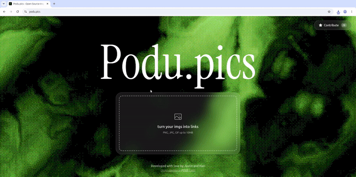

<p align="center">

<br>
<h1><strong>podu.pics -- An Open-Source ImgBB alternative</strong>  </h1>
<br/>

[](https://github.com/FOSSUChennai/podu.pics/blob/main/LICENSE) [](https://nextjs.org/) [](https://www.typescriptlang.org/) [](https://github.com/FOSSUChennai/podu.pics/stargazers)

</p>

<div align = 'center'>

</div>

## What it is?
Ever heard of an image host that lets you upload images, generate shareable links in a jiffy, and is completely free and open source?

No? That's because this is the first one.

[podu.pics](podu.pics) exists because most "free" image hosts aren't really free. 

(Because remember folks, in FOSS, ***FREE AS IN FREEDOM!***)

## Tech Stack

### **These are the awesome FOSS tools used in building this awesome project!**

<p align="left">
  
  
  
  
  
  
</p>

Built with **Next.js**, **React**, and **TypeScript**, styled with **Tailwind CSS**.

The animated background is powered by **Three.js** (via React Three Fiber, with Postprocessing for the shader effects). Images are stored in **Cloudflare R2** using the **AWS SDK**, with **NanoID** generating unique file identifiers. Icons from **Phosphor** and **Lucide**; **ESLint** keeps the codebase consistent.

## Getting Started

Clone the repo and install dependencies:

```bash
git clone https://github.com/FOSSUChennai/podu.pics.git
cd podu.pics
npm install
```

Copy the example environment file and fill in your own storage credentials:

```bash
cp .env.example .env
```

You'll need a Cloudflare R2 bucket (S3-compatible) — the free tier is enough for local development. You'll need your account ID, access key ID, secret access key, and bucket name from your Cloudflare dashboard.

Then run the development server:

```bash
npm run dev
# or
yarn dev
# or
pnpm dev
# or
bun dev
```

Open [http://localhost:3000](http://localhost:3000) with your browser to see the result.

You can start editing the page by modifying `app/page.tsx`. The page auto-updates as you edit the file.

This project uses [`next/font`](https://nextjs.org/docs/app/building-your-application/optimizing/fonts) to automatically optimize and load [Geist](https://vercel.com/font), a new font family for Vercel.

## Contributing

Contributions are welcome! Check open [issues](https://github.com/FOSSUChennai/podu.pics/issues) for something to pick up, or open a new one to discuss a feature or bug before submitting a PR.

## License

This project is licensed under the GPL-3.0 License — see [LICENSE](https://github.com/FOSSUChennai/podu.pics/blob/main/LICENSE) for details.

---
***Developed with love by [Justin](https://github.com/JustinBenito) and [Hari](https://github.com/nammahari) ! <3***
